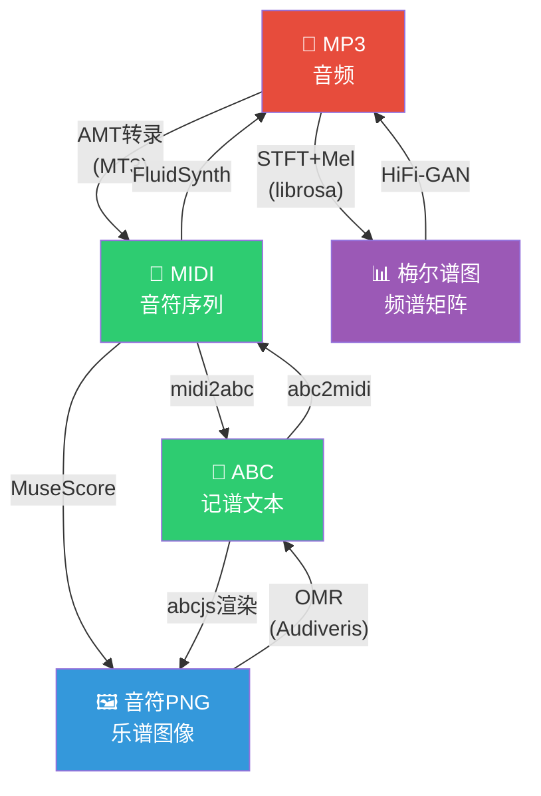

# 🎵 ABC Lyrics — 音乐表征双向转换工作室

> 以 **ABC 记谱法** 为 AI 原生格式，构建 MP3 / ABC / MIDI / 音符PNG / 梅尔谱图 五要素双向转换管线。

---

## 🧠 核心设计理念



> **ABC 是 AI 原生格式**：纯文本、结构化、Token 友好，LLM/Transformer 可直接消费。  
> **MIDI 是桥接层**：连接符号音乐（ABC）和音频世界（MP3/梅尔谱图）。  
> **梅尔谱图是音频指纹**：用于相似度检索、AIGC 反演。

---

## 📊 转换矩阵

```
         MP3         ABC         MIDI        音符PNG      梅尔谱图
MP3       —          🔴难        🟡中        🔴难         🟢易
ABC      🟢易         —          🟢易        🟢易         🟢易(via MP3)
MIDI     🟢易        🔴难         —          🟡中         🟢易(via MP3)
音符PNG  🔴难        🔴难        🔴难         —           🔴极难
梅尔谱图 🟡中        🔴极难      🔴难        🔴极难        —
```

| 图例 | 含义 |
|:--:|------|
| 🟢 | 确定性转换，质量高 |
| 🟡 | 可行但质量一般 |
| 🔴 | 困难 / 研究级 |

---

## 🗂️ 项目结构

```
abclyrics/
├── dist/                          # 前端产物
│   ├── index.html                 # 主页面
│   ├── logo.svg                   # Logo
│   ├── js/                        # 自研工具脚本
│   │   ├── test.js                # 测试脚本
│   │   ├── modfier.js             # Tauri 事件修饰器
│   │   ├── music-convert.js       # 转换注册中心 · 有向图路由
│   │   ├── abc-utils.js           # ABC 解析/生成/校验
│   │   ├── midi-utils.js          # MIDI 解析/生成/量化
│   │   ├── mel-spectrogram.js     # 梅尔谱图计算（Web Audio API）
│   │   └── audio-utils.js         # 音频缓冲/SoundFont 工具
│   └── lib/                        # 第三方文件资产
│       ├── abcjs-basic-min.js     # ABC 渲染引擎
│       └── midi.min.js            # MIDI 解析库
├── assets/
│   ├── lyrics/                    # ABC 曲谱歌词库
│   └── soundfonts/                # SoundFont 音源库
│       ├── FatBoy/                # FatBoy GM 音源
│       └── FluidR3_GM/            # FluidR3 GM 音源
├── src/
│   ├── lib.rs                     # Tauri 插件（open_url 等）
│   └── main.rs                    # 入口
├── docs/
│   ├── abc_standard_v2.1.pdf      # ABC 标准文档
│   └── abc_studio.md              # ABC 字段速查
├── icons/                         # 应用图标
├── Cargo.toml                     # Rust 依赖
├── tauri.conf.json                # Tauri 配置
├── cmd_debug.ps1                  # 开发调试脚本
└── cmd_build.ps1                  # 生产构建脚本
```

---

## 🚀 快速开始

```bash
# 开发模式
cargo tauri dev
# 或
.\cmd_debug.ps1

# 生产构建
cargo tauri build
# 或
.\cmd_build.ps1
```

---

## 🔧 转换管线 API 速览

```js
// 注册中心
import { convert } from './lib/music-convert.js';

// 直接转换
const midi = await convert(abcString, 'abc', 'midi');
const mp3  = await convert(midiBytes, 'midi', 'mp3');
const mel  = await convert(audioBuffer, 'mp3', 'melspectrogram');

// 自动路由（走最短路径）
const png = await convert('X:1\nK:C\nCDEF|', 'abc', 'sheetpng');
// 内部自动: ABC → abc2midi → MIDI → MuseScore → PNG

// 查看当前已注册的转换路径
console.log(convert.graph());
```

---

## 📐 转换邊品質说明

| 路径 | 方法 | 质量 | 备注 |
|------|------|:--:|------|
| ABC → MIDI | abc2midi | ⭐⭐⭐ | 确定性，无损 |
| MIDI → MP3 | FluidSynth | ⭐⭐⭐ | 依赖 SoundFont 质量 |
| ABC → 音符PNG | abcjs 渲染 | ⭐⭐⭐ | 矢量化，可缩放 |
| MP3 → 梅尔谱图 | STFT+Mel | ⭐⭐⭐ | 数学变换，无损 |
| 梅尔谱图 → MP3 | HiFi-GAN | ⭐⭐ | 有损反演，质量依赖模型 |
| MP3 → MIDI | MT3 转录 | ⭐⭐ | 多乐器/人声困难 |
| MIDI → ABC | midi2abc | ⭐⭐ | 需规则后处理 |
| 音符PNG → ABC | OMR | ⭐ | 手写谱几乎不可行 |

---

## 🧩 依赖外部工具

| 工具 | 用途 | 类型 |
|------|------|------|
| `abc2midi` / `midi2abc` | ABC ↔ MIDI | CLI (abcMIDI 套件) |
| FluidSynth | MIDI → WAV/MP3 | CLI / WASM |
| MuseScore CLI | MIDI/ABC → PNG/SVG | CLI |
| librosa / torchaudio | MP3 ↔ 梅尔谱图 | Python |
| HiFi-GAN / MelGAN | 梅尔谱图 → 音频 | Python / ONNX |
| MT3 / Basic Pitch | MP3 → MIDI | Python / ONNX |
| Audiveris | 音符PNG → MusicXML | Java CLI |

---

## 📝 License

MIT